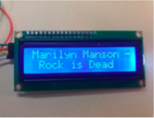

<b>Audio Player Arduino</b>

The main goal of the project was to install appropriate card in the SD module, use its contents to play audio file and display its name on the LCD screen. Additional feature is the ability to control the device via telephone connected to the device using a bluetooth module.
 

  
  

  

